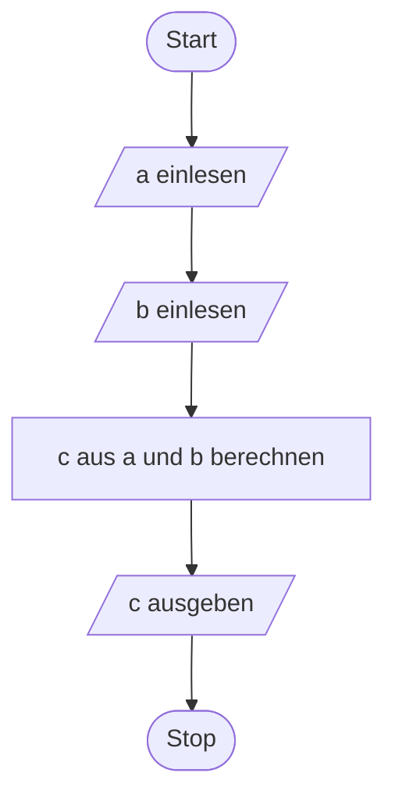
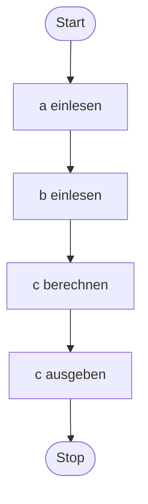
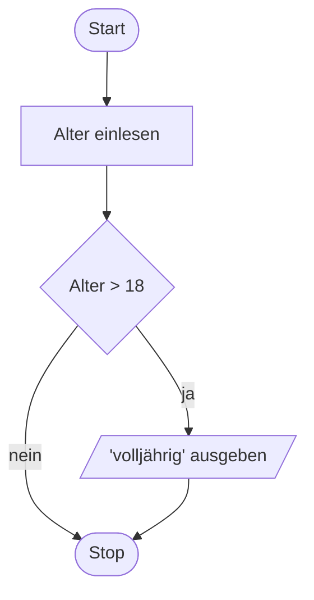

+++
date = '2025-09-08T06:39:18+02:00'
title = 'Darstellung von Programmen'
+++

Programmcode kann mit verschiedenen Arten von Diagrammen visualisiert werden. Eine häufig verwendete Form ist der _Programmablaufplan_ oder _Flussdiagramm_ (engl. _flowchart_).

Diese Seite bietet einen Überblick über die Notation des Programmablaufplans. Sie wird laufend um die neu gelernten Inhalte ergänzt.

## Start und Stop

Jedes Programm hat einen Start und ein Ende, symbolisiert durch ein Rechteck mit abgerundeten Ecken:


## Operationen und Sequenzen

Damit ein Programm aber tatsächlich auch etwas macht, benötigt es Operationen, symbolisiert durch ein Rechteck:


Dies entspricht dem folgenden C-Pseudocode:

```c
op1;
op2;
opn;
```

## Ein- und Ausgaben

Ein- und Ausgaben können mit einem Parallelogramm dargestellt werden:



Pseudocode:

```c
a = read(a);
b = read(b);
c = calc(a, b);
print(c);
```

Da Ein- und Ausgaben Operationen sind, kann man für sie auch das Rechteck verwenden:



## Verzweigungen

Verzweigungen werden mit einer Raute symbolisiert:



Die ausgehende _Kante_ (d.h. der Pfeil) soll jeweils angeben, ob die Bedingung zutrifft oder nicht.

Pseudocode:

```c
age = read();
if (age > 18) {
    print("volljährig");
}
```

### Verzweigung mit Alternative

Bei einer Verzweigung mit einer Alternative haben beide ausgehenden Kanten eine oder mehrere Operationen zur Folge:


Pseudocode:

```c
age = read();
if (age > 18) {
    print("volljährig");
} else {
    print("minderjährig");
}
```

### Mehrfachverzweigungen

Bei Mehrfachverzweigungen werden mehrere Rauten mit Bedingungen angegeben, z.B. verschachtelt bei "Unterfällen":


Pseudocode:

```c
age = read();
if (age > 18) {
    print("volljährig");
} else {
    if (age > 12) {
        print("jugendlich");
    } else {
        print("Kind");
    }
}
```
